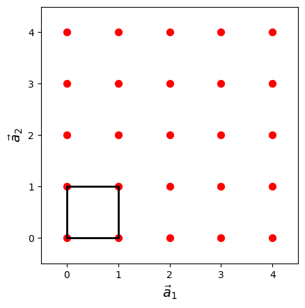
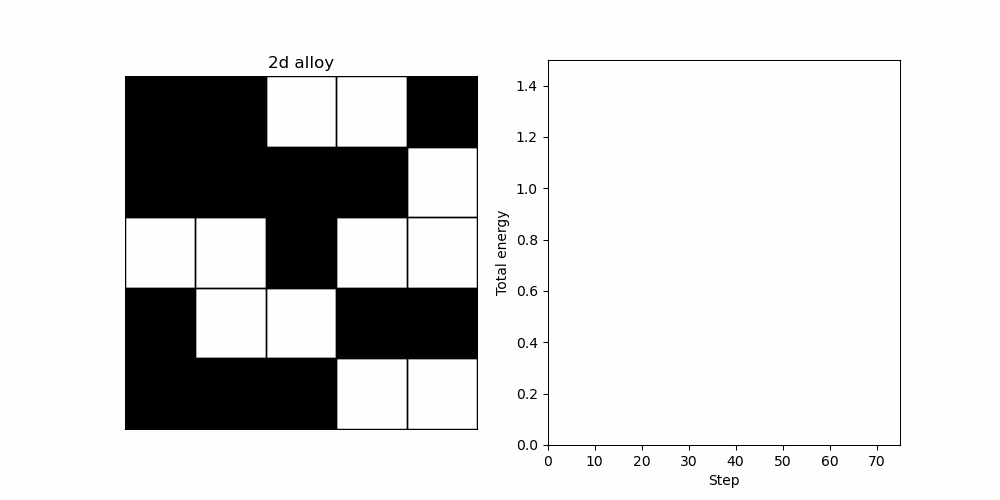
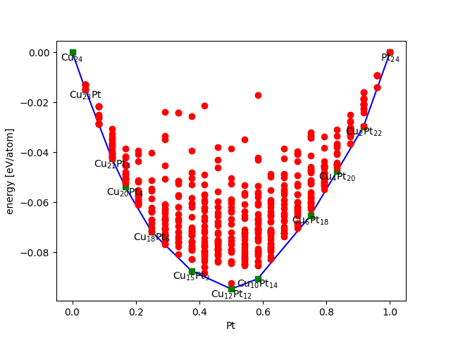

# Dealing with dissordered structures - Cluster expansion and Monte-Carlo sampling

## Lattice models
The cluster expansion technique makes use of an lattice representation of our system.

In three dimensions, a lattice can be defined as a regular arrangement of points in three-dimensional space, where each point has identical surroundings and the arrangement repeats itself periodically in all directions. More formally, a lattice in three dimensions can be defined as a set of points of the form $\vec{r} = n_1\vec{a}_1 + n_2\vec{a}_2 + n_3\vec{a}_3$, where $\vec{a}_1$, $\vec{a}_2$, and $\vec{a}_3$ are three linearly independent vectors called the lattice vectors, and $n_1$, $n_2$, and $n_3$ are integers.

The lattice vectors $\vec{a}_1$, $\vec{a}_2$, and $\vec{a}_3$ are chosen such that they form a parallelepiped that contains all the lattice points. This parallelepiped is called the unit cell of the lattice, and it represents the repeating pattern of the lattice.

The figure illustrates a 2d lattice with the unit cell marker out.

There are many types of lattices in three dimensions, each with different symmetry properties. Some common examples include the simple cubic lattice, the face-centered cubic lattice, and the body-centered cubic lattice. The simple cubic lattice is the most basic type of lattice, where each lattice point is at the corner of a cube. The face-centered cubic lattice has additional lattice points at the center of each face of the cube, while the body-centered cubic lattice has an additional lattice point at the center of the cube.

## Cluster expansion (CE)
The cluster expansion method is a computational technique used to model the energetics of alloys. It is based on the idea that the total energy of an alloy can be written as a sum of the energies of individual clusters, or groups of atoms, within the alloy.
In this method we use lattice representaion of our system. The cluster expansion method is typically used to calculate the configurational entropy and to predict the stable structures of alloys.

In mathematical terms, the total energy of a alloy configuration, $n$, can be represented as:

$$
\\
E_n = \sum_{i} c_{i,n}\Delta E_{i}
\\
$$

where $E_n$ is the total energy of the alloy configuration, $\Delta E_{i}$ is the energy of the $i$th cluster (the cluster coefficient), and $c_{i,n}$ is the concentration of the $i$th cluster within the alloy configuration.

As an example we can consider a 2-dimensional alloy where each lattice point is occupied with either a black or white atom (These could be two metals e.g. Ag and Pt). If we use a 5$\times$5 lattice to represent our system we have 25 lattice site and the possiblity of forming 2$^{25}=33'554'432$ unique alloy configurations. The figure below show one example of such configuration and illustrates how the CE approach can be use to determine it's energy.

***Figure.*** *Example showing how the energy of a 2-dimensional alloy is computed using a cluster expansion model. The model has three clusters, a horizontal dimer with energy $\Delta E_{1}=0.1$, a vertical dimer with energy $\Delta E_{2}=0.2$, and trimer with energy $\Delta E_{3}=-0.1$. In the animation cluster blue when they can be fitted at a certain position in the lattice.*

A cluster expansion model is typically parametrized using Density Functional Theory (DFT) data. In order to do so we calculate the total energies for several *simple* alloy configurations (using small enough supercells that we can afford to perform the time consuming DFT calculations). We need at least as many such configurations as the number of clusters included in our expansion if we like to determine all cluster coefficients. It is straight-forward to re-write the equation above into matrix from: 

$$
\begin{bmatrix}
E_{1} \\
E_{2} \\
\vdots \\
E_{n}
\end{bmatrix}
= 
\begin{bmatrix}
c_{1,1} & c_{1,2} & \cdots & c_{1,m} \\
c_{2,1} & c_{2,2} & \cdots & c_{2,m} \\
\vdots & \vdots & \ddots & \vdots \\
c_{n,1} & c_{n,2} & \cdots & c_{n,m}
\end{bmatrix}
\begin{bmatrix}
\Delta E_{1} \\
\Delta E_{2} \\
\vdots \\
\Delta E_{m}
\end{bmatrix}
$$

The cluster coefficients, $\Delta E_{i}$, can then be obtained from a *least-squares fit*. In practice we often apply regularization to obtain a more robust fit and to avoid problem with so-called overfitting. Once we have parametrized our model we can consider larger and more complex situations.  

The cluster expansion method relies on two key assumptions. The first assumption is that the energetics of an alloy can be accurately described by considering only short-range interactions between atoms. The second assumption is that the energy of a cluster can be calculated as a sum of the energies of its constituent atoms, plus a term that accounts for the interactions between the atoms within the cluster.

The cluster expansion method is a powerful tool for predicting the properties of alloys, particularly in cases where experimental data is limited. However, it requires accurate knowledge of the energetics of individual clusters, which can be difficult to obtain. Additionally, the cluster expansion method is limited to systems in which the interactions between atoms can be accurately described by short-range potentials.

## Convex hull and phase-diagrams
Cluster expansions and convex hull can be used together to construct a simple phase diagram for a given alloy system. The basic idea is to use the cluster expansion to calculate the energies of different configurations of the alloy, and then use the convex hull construction to identify the lowest-energy configurations, or phases, at a given composition.

The convex hull construction is a geometric method that can be used to identify the most stable phases at a given composition, based on the calculated energies of different configurations. The method involves plotting the energies of all possible configurations of the alloy as a function of their compositions, and then drawing a convex hull around the lowest-energy configurations. The points on the convex hull correspond to the most stable phases at the given composition, and the lines connecting these points represent phase boundaries.

To construct a simple phase diagram using these methods, one can follow these steps:

1. Calculate the energies of different configurations of the alloy using the cluster expansion method.

2. Use the convex hull construction to identify the lowest-energy configurations, or phases, at a given composition.

3. Plot the energies of all possible configurations of the alloy as a function of their compositions.

4. Draw a convex hull around the lowest-energy configurations, and identify the points on the hull as the most stable phases at the given composition.

Connect the points on the convex hull with lines to represent the phase boundaries.

The resulting phase diagram shows the stable phases of the alloy at different compositions, and the transitions between them. This can be useful in predicting the behavior of the alloy under different conditions, such as changes in temperature or pressure. However, if we only consider total energies of static structures we are neglecting to role of configurational dissorder in the system. For a given composition we may have many configruations with similar energies. The system is therefor typically better represented by a weighted average (from the Boltzmann distribution) over all these configuration, a so-called ensamble average. 

From the simple example above we realise that it will be unfeasible in the general case to compute the energy of all configurations, there is simply too many of them. Here, Monte-Carlo simulations can be used to rigoursly compute such ensemble averages without having to evaluate all these energies.

***Figure.*** *An example of a convex hull for a Cu-Pt alloy system. The solid blue line is convex hull and all point on it correspond to stable compositions (marked with formulas). Points above the hull are unstable. ([The figure is taken from the atomic simulations environment wiki page](https://wiki.fysik.dtu.dk/ase/tutorials/ga/ga_convex_hull.html).)*

## Metropolis Monte-Carlo (MC)

The Metropolis Monte Carlo simulation technique is a powerful computational method used to simulate the thermodynamcs of dissordered systems in condensed matter physics, chemistry, and materials science.

The Metropolis Monte Carlo simulation technique works by randomly proposing new configurations of the system, and accepting or rejecting them based on their energy difference relative to the current configuration. The probability of accepting a new configuration is determined by the Metropolis criterion, which ensures that the simulation samples the correct thermodynamic ensemble (it complies with the Boltzmann distribution).

The Metropolis criterion states that the probability of accepting a new configuration with energy difference $\Delta E$ is given by:

$$
\\
P(\Delta E) = min  \{ e^{-\Delta E/k_BT}, 1  \}
\\
$$

where $k_B$ is the Boltzmann constant, $T$ is the temperature, and $\Delta E$ is the energy difference between the proposed  configuration and the current configuration. This means that, if the propsoed configuration has a lower energy it is always accepted. 

In practice, the Metropolis Monte Carlo simulation technique involves the following steps:

1. Choose a starting configuration for the system.

2. Randomly propose a new configuration by moving one or more atoms or molecules in the system.

3. Calculate the energy difference between the proposed configuration and the current configuration.

4. Determine whether to accept or reject the proposed configuration based on the Metropolis criterion.

5. Record/save the current configuration into a data-base. *Note that the same configurations can be added twice or more when we reject proposed configurations. This is a key-point of the approach, low energy configuration shall be mre predominant in our data-base.* 

6. Repeat steps 2-4 for a large number $N$ of iterations , allowing the simulation to explore the configuration space of the system.

From the data-base generated in this procedure, we can calculate thermodynamic properties of the system, such as the heat capacity and free energy. In order to do so we simply take the average of the property calculated using all configurations in our data-base. For example the internal energy, $<U>$, can be calculated as follows:

$$
\\
<U> = \frac{1}{N} \sum_{n}^{N} E_i
\\
$$

where $N$ is the number of configurations in our data-base, and $E_n$ is the energy of configuration $n$. The concept can be generalized to any property that can be computed for the single configurations (so-called mechanical properties). 

$$
\\
<A> = \frac{1}{N} \sum_{n}^{N} A_n
\\
$$

[The concept os this type of sampling is neatly illustrated in this interactive example](https://chi-feng.github.io/mcmc-demo/app.html?algorithm=RandomWalkMH&target=banana).

## Combining CE and MC
The combination of cluster expansion and Monte Carlo simulations can be used to study a wide range of properties of alloys, such as phase stability, order-disorder transitions, and defects such as vacancies or interstitials. It also a very powerful technique to simulate Li intercalation on cathode and anonde materials in the context of batteries (see e.g. [Ref.](https://iopscience.iop.org/article/10.1088/1361-648X/ab1bbc))

 The method can also be used to construct a phase diagram that shows the stable phases of the alloy as a function of temperature and composition.

### Tutorial

<b>Assignment:</b>

Use the tutorial to predict the voltage profile (at various levels of approximation) for a cathode material where a spinel structured $LiMn_2O_4$ consists the intercalation material.

<b>Submission instructions:</b>

Upload your commented version of the note-book to the studium page. 

### Further reading:

1. [A pedagocially written article on the subject](https://iopscience.iop.org/article/10.1088/1361-648X/ab1bbc)

2. [An extensive DFT based study of the Ag-Pt system](http://manuscript.elsevier.com/S1359645416308205/pdf/S1359645416308205.pdf)

3. [Chapter 3 in *Understanding Molecular Simulation : From Algorithms to Applications* by Daan Frenkel & Berend Smit](https://ebookcentral.proquest.com/lib/uu/reader.action?docID=307221)

4. [Chapter 6 in *Atomistic Computer Simulations : A Practical Guide* by Veronika Brázdová and David R. Bowler](https://ebookcentral.proquest.com/lib/uu/reader.action?docID=1161544)